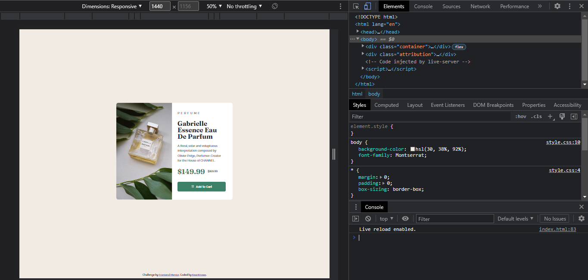

# Frontend Mentor - Product preview card component solution

This is a solution to the [Product preview card component challenge on Frontend Mentor](https://www.frontendmentor.io/challenges/product-preview-card-component-GO7UmttRfa). Frontend Mentor challenges help you improve your coding skills by building realistic projects. 

## Table of contents

- [Overview](#overview)
  - [The challenge](#the-challenge)
  - [Screenshot](#screenshot)
  - [Links](#links)
- [My process](#my-process)
  - [Built with](#built-with)
  - [What I learned](#what-i-learned)
  - [Continued development](#continued-development)
- [Author](#author)

## Overview

### The challenge

Your challenge is to build out this product preview card component and get it looking as close to the design as possible.

You can use any tools you like to help you complete the challenge. So if you've got something you'd like to practice, feel free to give it a go.

Your users should be able to:

- View the optimal layout depending on their device's screen size
- See hover and focus states for interactive elements

### Screenshot

### Links

- Solution URL: [Frontend Mentor Solution](https://www.frontendmentor.io/solutions/vanilla-css-with-media-queries-responsive-product-preview-card-uQnbYL7paP)
- Live Site URL: [Live Site](https://github.com/keanknowsss/Product-Preview-Card-Component-Solution)

## My process

### Built with

- Semantic HTML5 markup
- CSS custom properties
- Flexbox
- Media Queries
- Desktop-first workflow

### What I learned

Learned a lot about units, when to use vw, rem, and px. Also learned about media queries and how it should be implemented in the css.

### Continued development

This can be useful for Online Shop Sites Development, responsive for both Desktop and Mobiles.

## Author

- Frontend Mentor - [@keanknowsss](https://www.frontendmentor.io/profile/keanknowsss)

